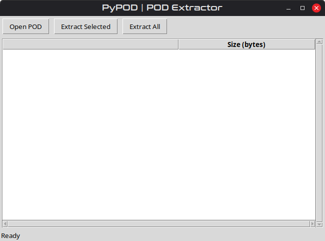
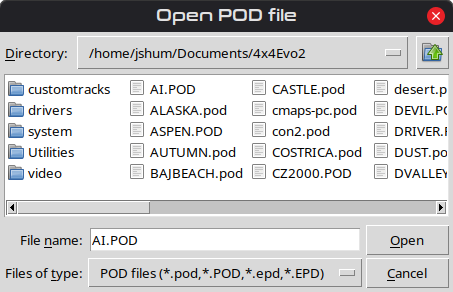
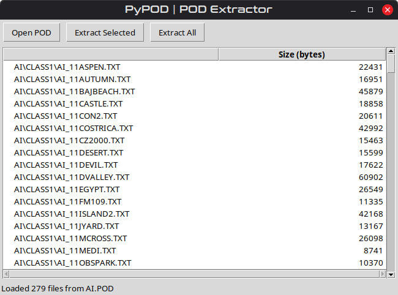
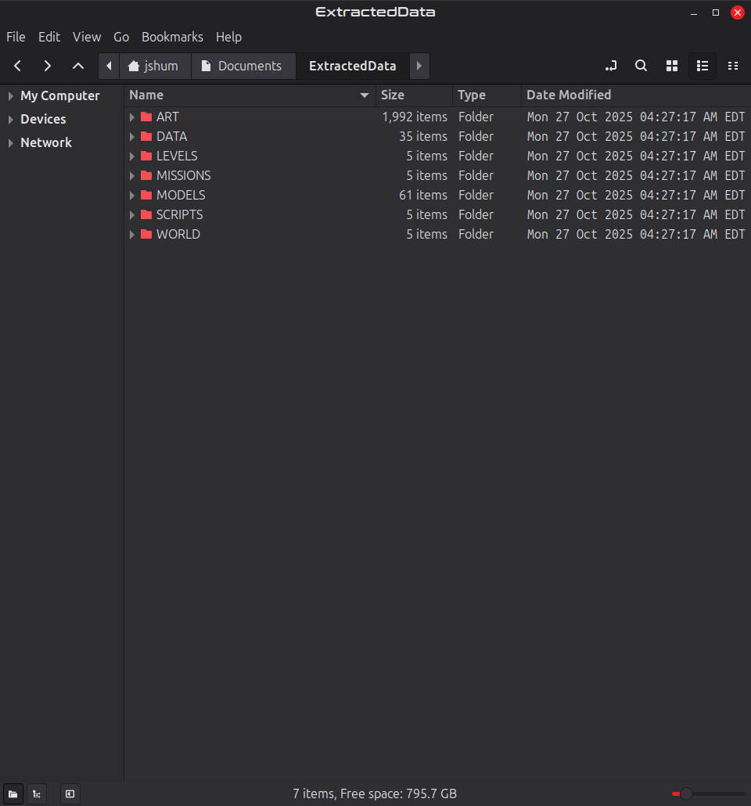

# 🗜️ Python-POD - POD Extraction Tool
**Author:** Johnny Shumway (jShum00)
**License:** MIT
**Version:** 1.1

A simple, easy-to-use POD extractor tool, adapted from Dummiesman's [Poddy](https://github.com/Dummiesman/Poddy/tree/main/PODTool) project.
Used to extract contents of **Terminal Reality .POD/.pod** data files.

This tool includes:
- **PyPOD.py** - simple POD extractor with Tkinter GUI. (Main App)
- **POD_Handling.py** - robust POD parser and extraction helper (extracts everything for the GUI)
- **Constants.py** - provides Constants used during the export process.

---

## 🚀 Features
- Loads and displays the contents of `.POD`/`.pod` models
- A simple easy-to-use interface
- Speedy data extraction
- Lightweight application

---

## 📸 Screenshots
Below are a few screenshots of the tool in-action:

**Demo**<br />


**First Look**<br />


**Opening PODs**<br />


**Loaded Data**<br />


**Extracted Data**<br />



---

## 🖥️ Requirements

Only dependency is Tkinter, which normally comes pre-installed with most Python distributions.
Tested on Python 3.10+ (Linux).

---

## ⌨️ Controls
| Button             | Action                                                      |
|--------------------|-------------------------------------------------------------|
| LMB                | Select the entry item in the tree-view.                     |
| 'Open POD'         | Opens a dialog for you to select the POD file of choice.    |
| 'Extract Selected' | Extracts one or more individually selected items.           |
| 'Extract All'      | Extracts all content from the POD to a designated location. |

--- 

## 📁 File Overview

`PyPOD.py`
The main GUI, run this to use the app.

`POD_Handling.py`
The script that handles POD extraction.

`Constants.py`
A data class with constants that are used by `POD_Handling.py`.

---

## 🔧 Example Usage

Run the GUI:
```bash
python3 PyPOD.py
```

---

## 🧠 Notes
The .POD/.pod format was used by Terminal Reality's EVO engine (circa 2000s).
The POD file was used to store game assets and data in a proprietary format, 
these PODs were not compressing game data, rather a collective place to store them.
An example is `TRUCK.POD` in 4x4 Evo 2, which kept the truck game models, textures, and more.

---

## 🧬 Credits
Adapted from [Dummiesman's](https://github.com/Dummiesman/) [Poddy Tool](https://github.com/Dummiesman/Poddy/tree/main/PODTool) and into Python for cross-platform usage. Programmed by
Johnny Shumway.

---

## 📜 License
This project is licensed under the MIT License — free for learning, modification, and redistribution.

# The MIT License (MIT)
Copyright © 2025 **Johnny Shumway**

Permission is hereby granted, free of charge, to any person obtaining a copy of this software and associated documentation files (the “Software”), to deal in the Software without restriction, including without limitation the rights to use, copy, modify, merge, publish, distribute, sublicense, and/or sell copies of the Software, and to permit persons to whom the Software is furnished to do so, subject to the following conditions:

The above copyright notice and this permission notice shall be included in all copies or substantial portions of the Software.

THE SOFTWARE IS PROVIDED “AS IS”, WITHOUT WARRANTY OF ANY KIND, EXPRESS OR IMPLIED, INCLUDING BUT NOT LIMITED TO THE WARRANTIES OF MERCHANTABILITY, FITNESS FOR A PARTICULAR PURPOSE AND NONINFRINGEMENT. IN NO EVENT SHALL THE AUTHORS OR COPYRIGHT HOLDERS BE LIABLE FOR ANY CLAIM, DAMAGES OR OTHER LIABILITY, WHETHER IN AN ACTION OF CONTRACT, TORT OR OTHERWISE, ARISING FROM, OUT OF OR IN CONNECTION WITH THE SOFTWARE OR THE USE OR OTHER DEALINGS IN THE SOFTWARE.

